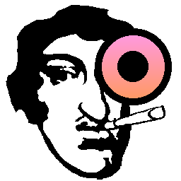

<h1>
  
  Slag
</h1>
Which stands for Simple Luminiferous Associated Geometrification, an acronym I made up just to waste your time. Supports .OBJ, as well as basic mesh modifiers like extrude, delete, scale, rotate and so on.
 
 
There is a long list of things to be done, this project has no real value outside of learning. My end goal is to support texturemapping and texture painting.